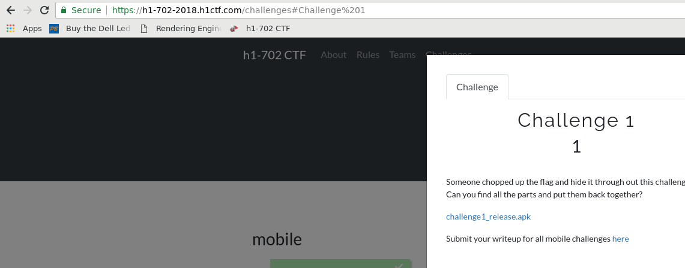

# Challenge 1 Writeup

Hi all,

Those who know me may know that recently I quit my job, and I have been spending the entirety of my time on what could be considered an extremely risky financial proposition: finding vulnerabilities in third party sites that implement bug bounties. Bug bounties, for those of you who do not know, are programs offered by some of the largest and more secure companies in the world that am	ount to the following challenge: "if you find a vulnerability on our services, we'll give you this big pile of cash." You can see my hackerone page and how I am [doing here](https://hackerone.com/droope).

In the meantime, to have some variety, research time and the opportunity to meet up with the community, my partner convinced me to participate in this year's HTS 702 CTF event. I don't want to summarise everything here, but it's my understanding that the winners of these CTFs will be awarded a trip to Vegas based on a set of metrics. I am writing these blog posts here mainly to summarise my experience and to provide readers with evidence that I have not died and abandoned this blog for ever.

## Prerequisites 

I decided to go ahead with the mobile challenges because I have been procrastinating on setting up my Android hacking infrastructure for far too long and this is a good excuse to set it up. In order to do these challenges you will require:

* An android device with "Developer Mode" enabled. Preferably Android 7.x.
* A Desktop computer with Android Debug Bridge (ADB) installed. If you have linux, you can install it by running `apt install android-tools-adb`. ADB is a command-line utility that allows you to, for example, install apps inside your phone from your computer.
* A dissassembler. Good candidates are [Hopper](https://www.hopperapp.com/) if you are using Linux/Mac or [IDA](https://www.hex-rays.com/products/ida/support/download.shtml) if you are using Windows. Both of these offer free trials and I will be using the free trial for Hopper.

## Getting Started
Once you register to the CTF you will be able to access the challenges section. You  can then download the `.apk` file, as below:

 

You may not know this, but `.apk` files are the standard format for Android applications. I'm no expert, but I know that I know that there is this awesome tool out there called `apktool`, which we can install by running `apt install apktool` in debian, or we can install by [other means](https://ibotpeaches.github.io/Apktool/install/). We open up a shell, navigate the shell to the directory where the apk lives, and run:

```
$ apktool d challenge1_release.apk 
I: Using Apktool 2.3.3-dirty on challenge1_release.apk
I: Loading resource table...
I: Decoding AndroidManifest.xml with resources...
I: Loading resource table from file: /home/user/.local/share/apktool/framework/1.apk
I: Regular manifest package...
I: Decoding file-resources...
I: Decoding values ** XMLs...
I: Baksmaling classes.dex...
I: Copying assets and libs...
I: Copying unknown files...
I: Copying original files...

$ cd challenge1_release/
$ ls
AndroidManifest.xml  apktool.yml  lib  original  res  smali
```

Based on my awesome all-encompassing knowledge of all the things, I "know" that this "extracts" the file and "decodes" some of the files within the apk. As you may know, Android applications are coded in a near-verbatim variation of the Java programming language. Because java is compiled, some aspects of it are lost during compile time, and we will have an approximation of the bytecode in the `smali` folder. Smali is great because it allows you to "repackage" or "crack" Android applications, which I feel will come in handy for future challenges.

Some folders of note are `lib` which contains libraries of some description and `res` that contains resources. `AndroidManifest.xml` and `apktool.yml` contain metadata about the `.apk`.

My Android client-side testing methodology is pretty basic, and is as follows:

1. Check the resource folder for private keys, passwords, sensitive files or *ahem* flags.
2. Check the Smali code for strings. Strings are the root of all evil.
3. And now finally a made up step that I am inventing right now because I don't normally do it: check the libraries embedded in the `.apk`

## Checking the res/ folder

This is an easy one. Go through every line in every file in the res folder to make sure there's not anything there that reeks of the evil winds of hell.  Unfortunately there's quite a few files, with 5828 lines of XML code. Most of it is duplicated and your instinct will start telling you what to skip. I was immediately drawn to the `values` folder. Frequently there's strings for translation purposes in `res/values/strings.xml`. In this case, after missing it for the first time, I found the third part of the flag first there:

```
$ cat res/values/strings.xml 
<?xml version="1.0" encoding="utf-8"?>
<resources>
    <string name="abc_action_bar_home_description">Navigate home</string>
[...]
    <string name="app_name">Challenge 1</string>
    <string name="part_3">part 3: *analysis_*</string>
[...]
</resources>
```

## Checking the smali/ folder

Now I am going to be really honest with you here: I don't know much about smali. To my untrained eye, it seems like a crazy programming language. Like, just look at it, it makes no sense!

 

Uh... OK, so `const-string` is how you have constant strings, I guess. Above is the first flag, which I found because I read a file called `MainSomethingSomething` in the `challenge1` folder. Let's try and find more of these precious `const-strings`. I've gone into the `challenge1` folder to run this command to exclude the base Java classes that are also in the APK.

```
$ grep -nHR 'const-string'
FourthPart.smali:21:    const-string p0, "w"
FourthPart.smali:29:    const-string p0, "_"
FourthPart.smali:37:    const-string p0, "h"
FourthPart.smali:45:    const-string p0, "m"
FourthPart.smali:53:    const-string p0, "o"
FourthPart.smali:61:    const-string p0, "w"
FourthPart.smali:69:    const-string p0, "c"
FourthPart.smali:77:    const-string p0, "u"
MainActivity.smali:10:    const-string v0, "native-lib"
MainActivity.smali:32:    const-string p0, "Part 1"
MainActivity.smali:34:    const-string v0, "The first part of your flag is: \"flag{so_much\""
MainActivity.smali:62:    const-string v0, "Reverse the apk!"
```
We find our flag again, and we also find what seem to be chopped up pieces of another string... opening up the `FourthPart.smali` part shows that there are what appear to be several numbered functions, `one`, `two` and so on:

```
.method one()Ljava/lang/String;
    .locals 0

    const-string p0, "m"

    return-object p0
.end method
```
What I did was grab the value of the method `one`, "m" in this case, and concatenate it with the value of the next few functions until I had done them all. The fourth string looked like this: `much_wow`. Going through the numbers in my head, it appears we have several parts: the first, the third and now the fourth. We're missing at least the second, and possibly the fifth because we are missing the closing curly bracket.

## The made up third step: look at the lib/ folder.

I gotta be honest, when I first saw the `lib/` folder I thought it was something I didn't want to look at, because I thought it was an embedded Android library. Maybe I was fooled by the name of the libraries, `libnative-lib.so`.  Frequently for me looking at disassembly feels a bit like walking in the fog in the sense that I don't see everything in the program's execution flow clearly, as I may do when reading for example Java code. What I tend to do is look for strings and symbols. I am going to use Hopper because I am running Linux, but the process should be similar when using other tools. We start it up and open the executable by going `File > Read Executable to Disassemble`.

Here you can choose one of several architectures the libnative library has been compiled to, in my case because I am using Hopper and I know Hopper's strong suit is the ARM architecture I'll open `armeabi-v7a/libnative-lib.so`. I don't really know what the options are at the prompt so I just click OK.

 

There you can see a few tabs. `Labels` contains labels present in the binary, and `Strs` contains strings. When I click the window and look for strings I can immediately see the second flag.

 

If we put all the parts of the flag we have now together, it looks like this:

```
flag{so_much_static_analysis_much_wow
```

It seems to me we're missing the end of the string. There's another tab next to `Strs` called `Procs`, which is short for procedures, which is an assembly term for functions or methods. I clicked that and I saw something that looked weird to me. Right next to a `hackerone` method there were a bunch of single-letter methods, like this:

 

Clicking one of the methods takes us to its disasembly:

 

It seems to me that it is using the `movs` instruction to move a value into a register, in this case `r0`. `r0` is the register used for storing return values in the [ARM calling convention](https://wiki.osdev.org/ARM_Overview#Calling_Convention_Cheat_Sheets), so it seems it is returning a value, which looks suspiciously like the hexadecimal value of an ASCII character. I will use an [ASCII table](https://www.rapidtables.com/code/text/ascii-table.html) to look it up, like below:

 

It shows that it corresponds to an underscore. I click the next function down, `z()` and the char corresponds to an `a` character. Carrying on with the functions in order, we get a stream of bytes that looks like: `_and_cool}`. With this, we complete the flag.

```
flag{so_much_static_analysis_much_wow_and_cool}
```

 
